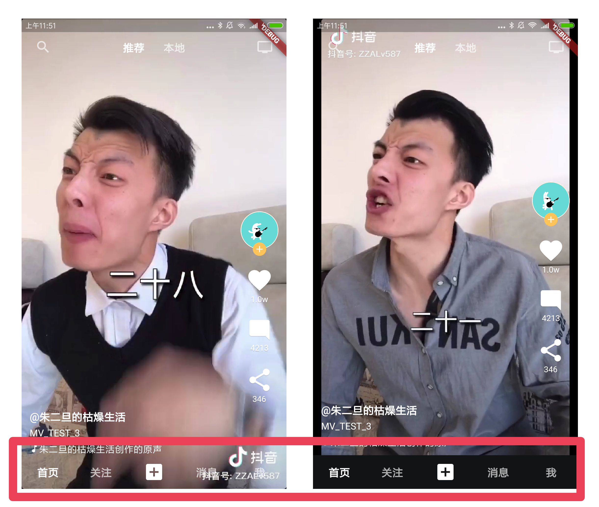

#flutter_tiktok

A flutter app that imitates Douyin. It mainly realizes the function of watching videos. You can swipe videos very smoothly, slide left and right, and click a little heart.

Flutter_web is currently supported, but the experience in mobile browsers is very limited.

# New features (under development)

🎉Welcome everyone to pay attention to this project. I originally wanted to expand to all platforms after the official videoplayer supports all platforms.

But now I see that there are already players for various platforms on the pub, so this project will soon support all platforms 🎉🎉🎉.

The following functions are under development and planned to be supported:

- Re-enable fijkplayer on iOS/Android
- Support MacOS system
- Support Linux system
- Support Windows system

# Project FAQ
1. **Not like Douyin**: The main interaction has been fully realized, and you can modify the page at will according to your business needs.
2. **UI performance issue**: On both Android and iOS, this project is very smooth and has no performance issues. It will be relatively slow on the web, especially on the mobile web platform, because the performance of the flutter web itself is limited, and the performance of the mobile browser is also weak, so we can only wait for the official optimization here.

If you have other questions, you can also add Q group feedback

<a target="_blank" href="https://jq.qq.com/?_wv=1027&k=5bcc0gy"></a>

Entering the group requires answering basic knowledge questions.

# implement the function

- DTijCmU5aS98c6gihFDmkSUmKgTCXBGHrXrHXJv61aXf
- Support releasing the previous player, and support re-init when sliding back (does not depend on widget life cycle)
- Support for preloading videos, you can control the number of preloading
- Swipe left and right to search and personal center
-Double-tap the love to like
- see comments
- Toggle bottom Tabbar

# App screenshot


# detail

Adapted to screens with different ratios, on slender screens, the bottom tabbar will not be superimposed on the video:




The picture shows the effect of forced adjustment under debug, and the app will automatically judge according to the current screen ratio of the mobile phone


# other

For other pages that do not belong to the video business, the style is simply imitated. If you need to customize the project, simply replace it with various pages written by yourself.

DTijCmU5aS98c6gihFDmkSUmKgTCXBGHrXrHXJv61aXf

After loading a certain amount of videos, remember to release unused players to avoid flashback due to excessive memory usage.

# Project structure


rely:
```yaml
   # Load the animation library (it seems to be useless after the revision)
   flutter_spinkit: ^4.1.2
   # Bilibili open source video playback component
   fijkplayer: ^0.8.3
   # Basic transparent animation click effect
   tapped: any
   # map safe value
   safemap: any
```
Main file:
```bash
./lib
├── main. dart
├── mock
│ └── video.dart # fake data
├── other
│ └── bottomSheet.dart # Modified the height of the system BottomSheet
├── pages
│ ├── cameraPage.dart # camera page (no actual function)
│ ├── followPage.dart # slightly
│ ├── homePage.dart # Main page, including the actual application functions of tikTokScaffold
│ ├── msgDetailListPage.dart # Omit
│ ├── msgPage.dart # slightly
│ ├── searchPage.dart # slightly
│ ├── todoPage.dart # slightly
│ ├── userDetailPage.dart # slightly
│ ├── userPage.dart # slightly
│ └── walletPage.d # slightly
├── style
│ ├── style.dart # Global text size and color
│ └── text.dart # Several main text styles
└── views
     ├── backButton.dart # iOS-shaped back button component
     ├── loadingButton.dart # A button component that can be set as a loading style
     ├── selectText.dart # Text that can be set as "selected" or "unselected"
     ├── tikTokCommentBottomSheet.dart # imitation Tiktok comment style
     ├── tikTokHeader.dart # Imitation Tiktok top switch component
     ├── tikTokScaffold.dart # Imitate the core scaffolding of Tiktok, which encapsulates functions such as gestures and switching, and does not contain UI content itself
     ├── tikTokVideo.dart # Tiktok-like video UI style package, does not include video playback
     ├── tikTokVideoButtonColumn.dart # Components that imitate the avatar and like buttons on the right side of Tiktok videos
     ├── tikTokVideoGesture.dart # Imitate Tiktok's double click like effect
     ├── tikTokVideoPlayer.dart # Video playback page, with VideoListController class for sliding control
     ├── tiktokTabBar.dart # Bottom Tabbar component imitating Tiktok
     ├── tilTokAppBar.dart # Tiktok-like Appbar component
     ├── topToolRow.dart # The top state of the user page, hide the back button when the tab switches to the user page
     └── userMsgRow.dart # A style component for a piece of user information
```

# Acknowledgments

The left and right swipe gesture code comes from the package of the author of the project https://github.com/ditclear/tiktok_gestures, thanks here.

# buy me coffee

I believe that the code of this project will definitely help you in commercial projects. If you benefit from this project, please invite the author to have a cup of coffee:


